EN / [CN](./README_CN.md)

# WLZY_Indoor_Environment_Monitoring_System
For 2018 Jinling Institute of Science and Technology Development Competition

### Team Members ###
WANG JIAHUA, [LI KECHEN](https://github.com/dxlkc), WANG PENG, ZHAO ZELIANG, YIN PEIQI

### Introduction ###
This is a system used to monitor the indoor environment, with three parts: terminal devices, backend server, and frontend server. The terminal devices can work offline, it's connected to sensors, cameras and a touch-enabled display screen. Users can observe environmental data and perform some settings through the display screen.

When the terminal device is connected to the network, user can observe the environmental data, view the curve of the data and view the picture of the camera through the web page. When environmental data reaches a threshold set in advance by the user, an email will be sent to notify the user.

### Technology Stack ###
**Backend:** JAVA, SpringBoot, MQTT, InfluxDB, MySQL, Mybatis, MJPG-Streamer

**Frontend:** HTML, CSS, JavaScript, Websocket, ECharts 

**Device:** C++, SQLite3, RE-485, MJPG-Streamer, QT5

### Architecture ###

### Terminal Device Screenshots ###

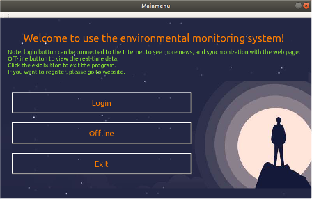
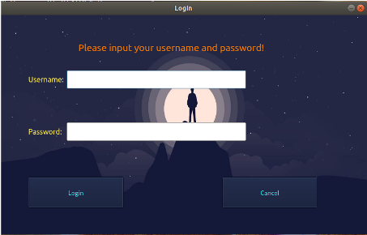
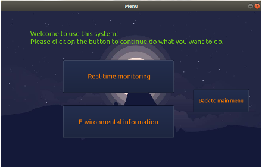
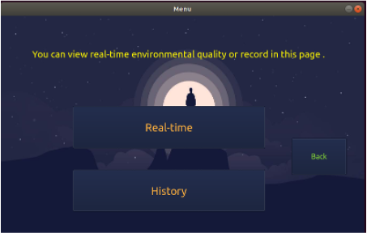

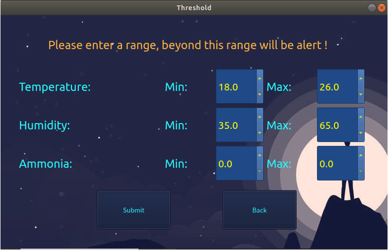
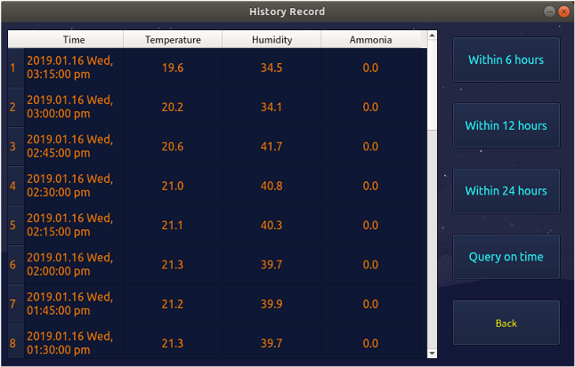
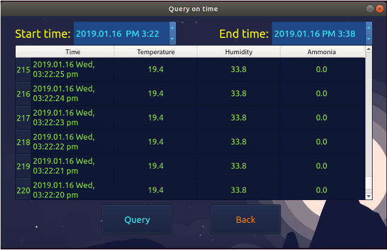

### Website Screenshots ###

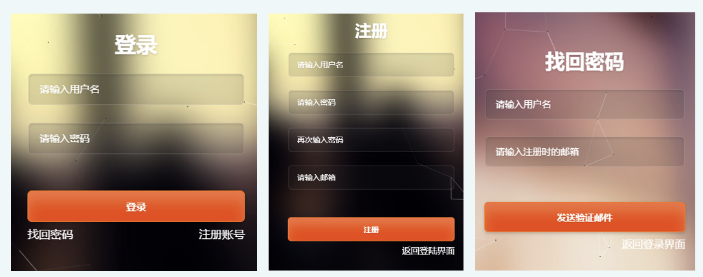
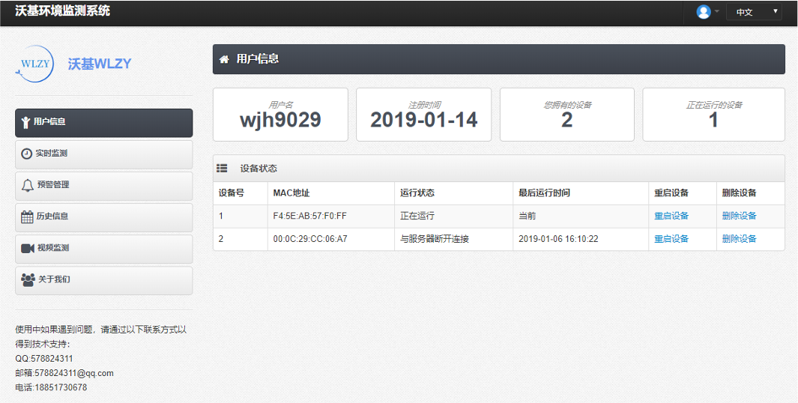
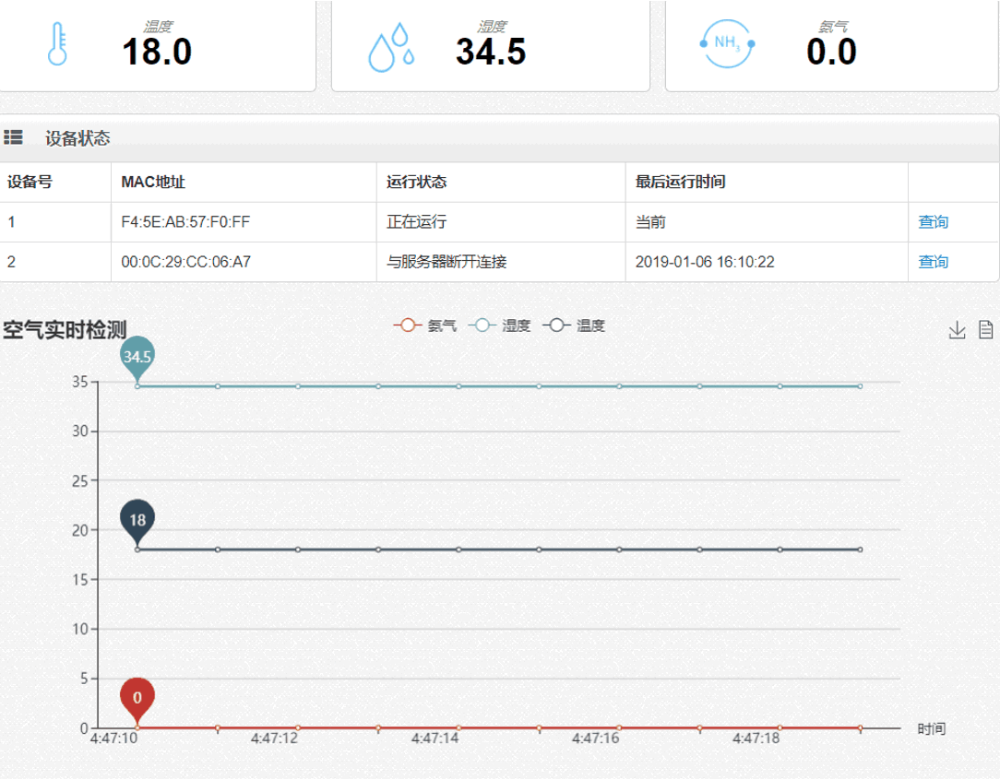
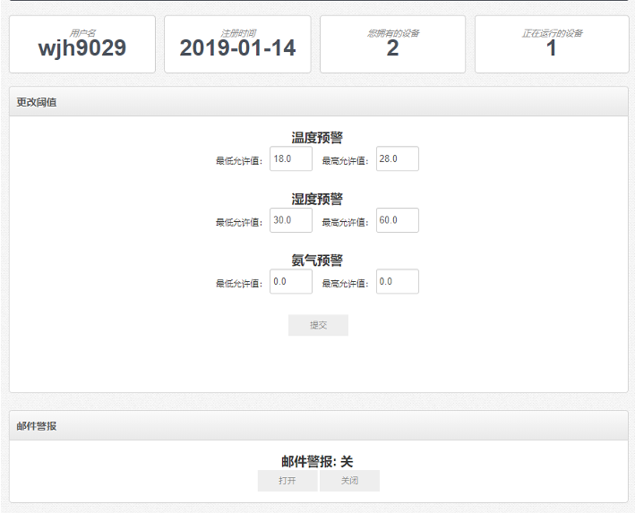
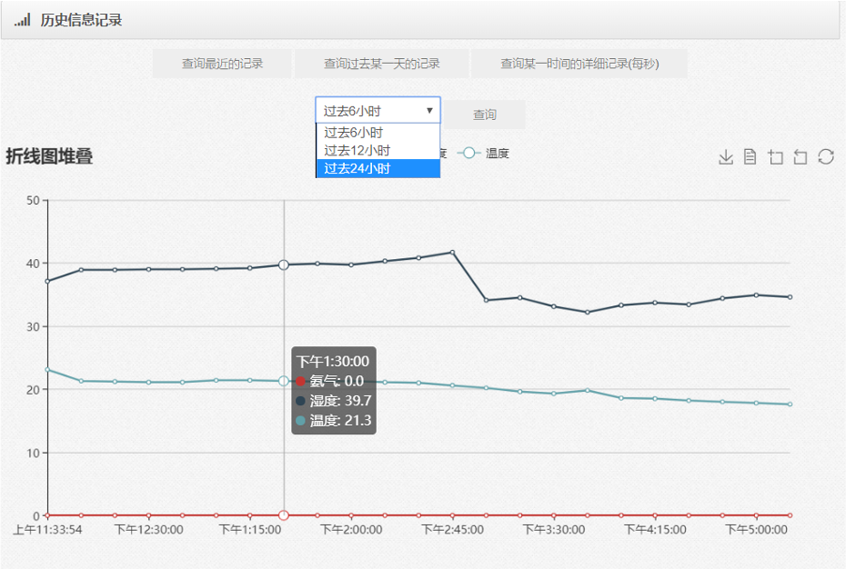
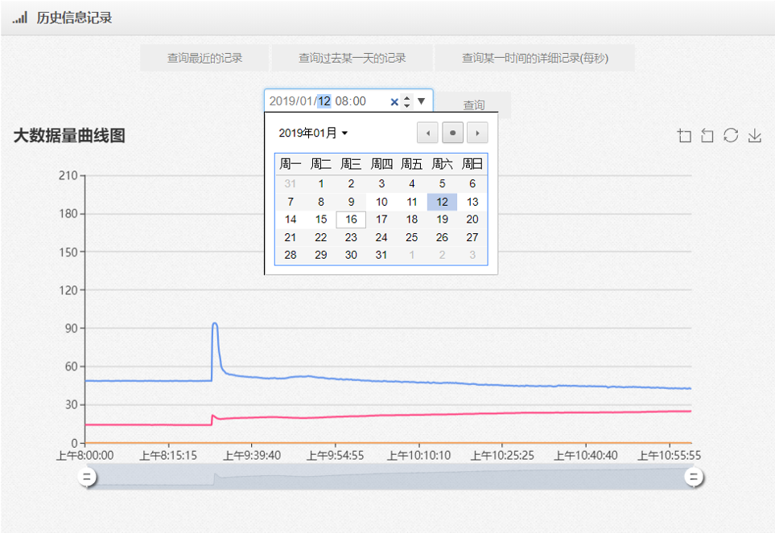
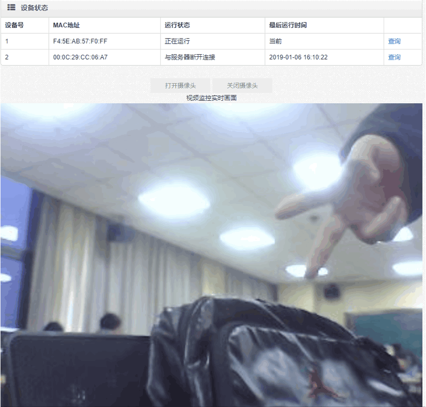

