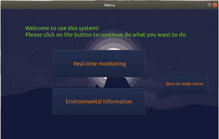
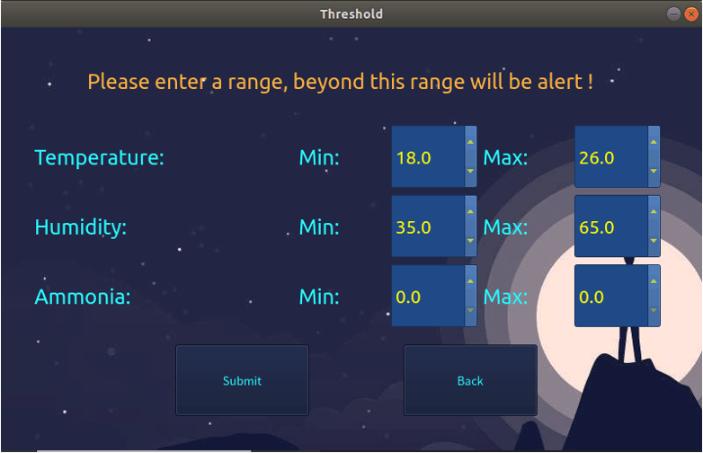
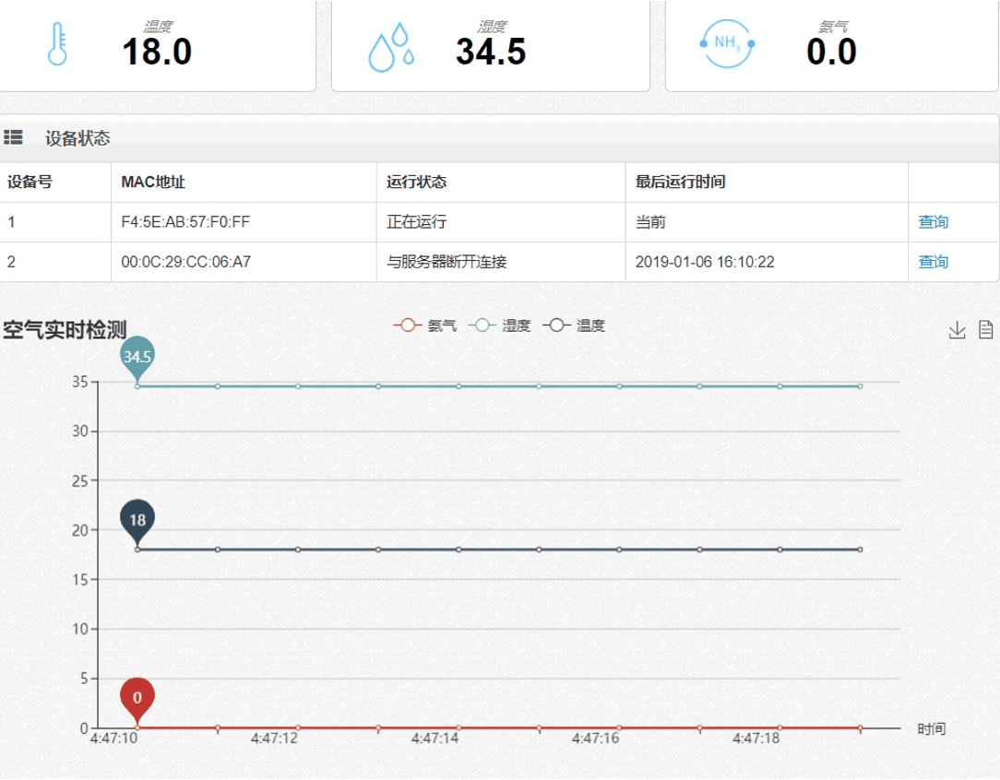
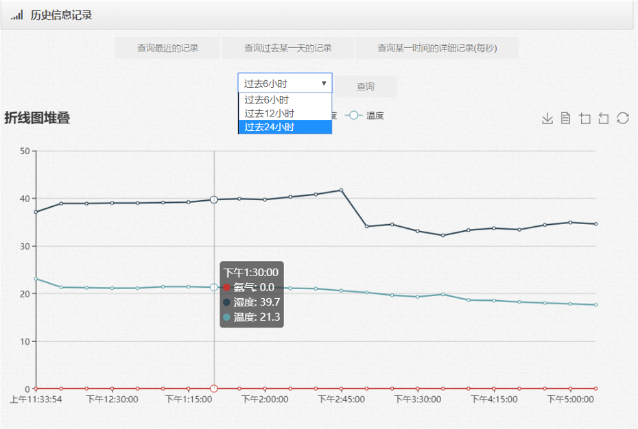

# WLZY_Indoor_Environment_Monitoring_System

### Team Members ###
WANG JIAHUA, [LI KECHEN](https://github.com/dxlkc), WANG PENG, ZHAO ZELIANG, YIN PEIQI

### Introduction ###
这是一个用来监控室内环境情况的系统，具有终端设备，服务器，前端页面三个部分。终端设备可以离线工作，它连接了传感器，摄像头和一个可以出触控的显示屏，用户能够通过显示屏来观察环境数据以及进行一些设置。
在终端设备接入网络的情况下，用户能够通过网页来观察环境数据，查看历史数据的曲线以及查看摄像头的画面。当环境数据达到了用户提前设置的阈值之后，会向用户发送电子邮件来通知。

### Technology Stack ###
**Backend:** JAVA, SpringBoot, MQTT, InfluxDB, MySQL, Mybatis, MJPG-Streamer

**Frontend:** HTML, CSS, JavaScript, Websocket, ECharts 

**Device:** C++, SQLite3, RE-485, MJPG-Streamer, QT5

### Architecture ###

### Terminal Device Screenshots ###

### Website Screenshots ###

